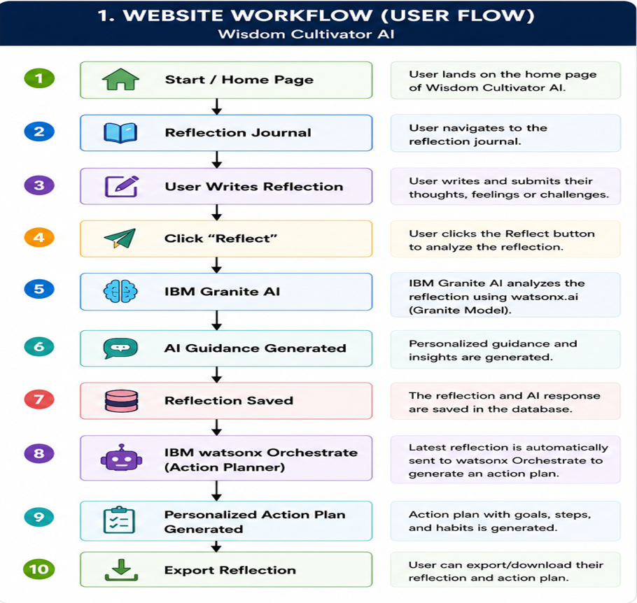
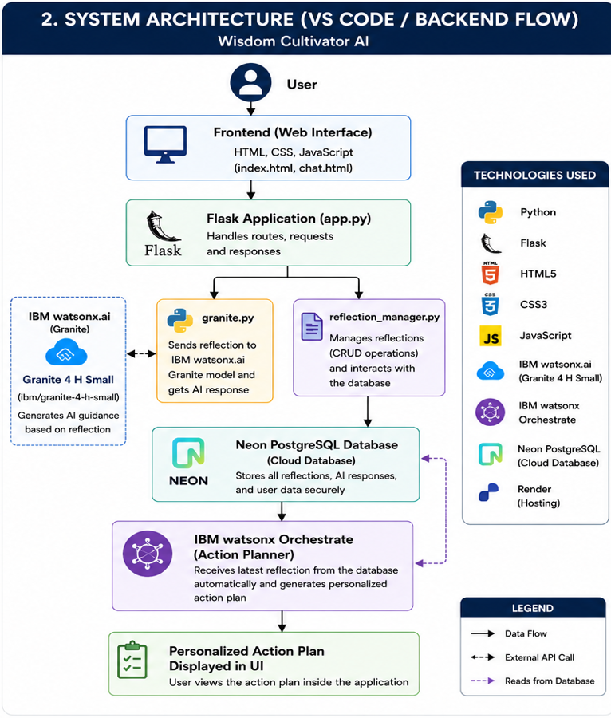
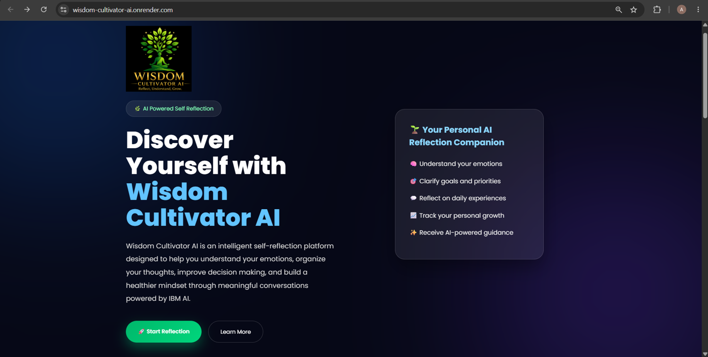
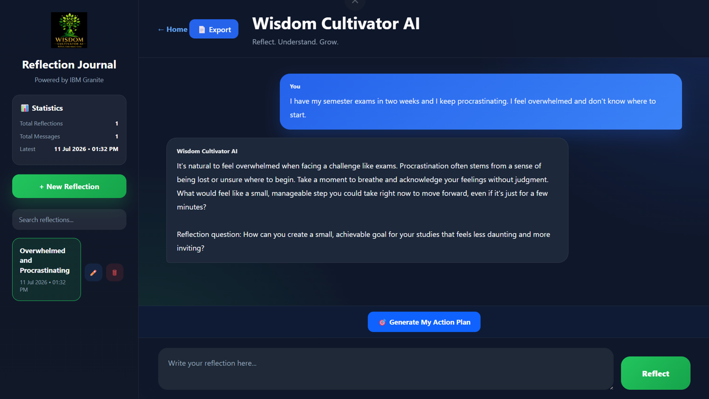
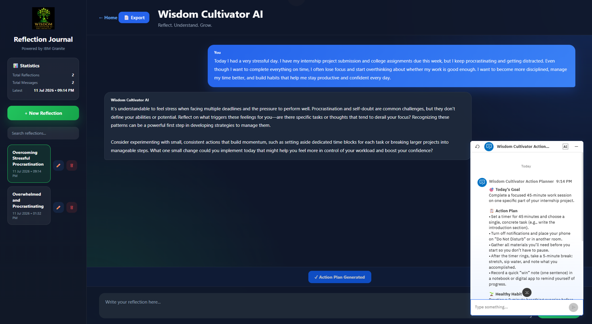
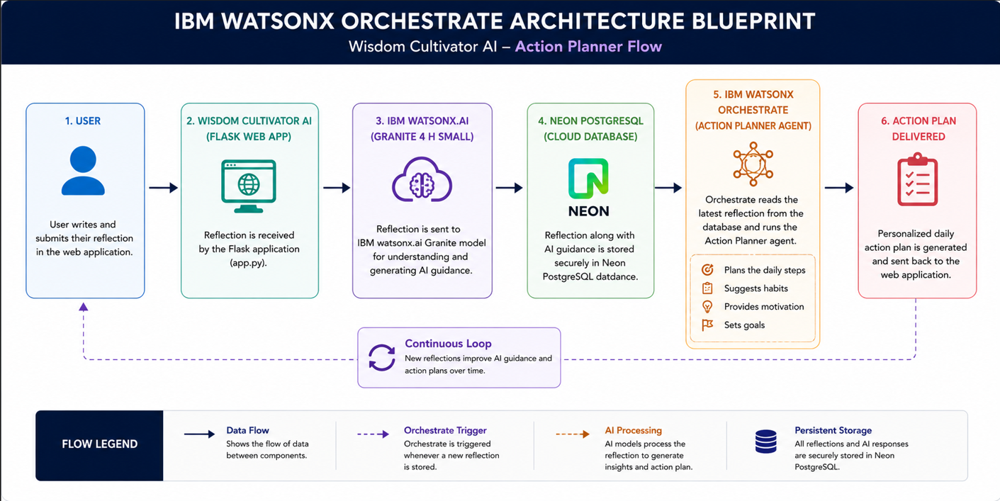

# 🌱 Wisdom Cultivator AI

### AI-Powered Self Reflection & Personal Growth Assistant

Transform your thoughts into meaningful actions using **IBM watsonx.ai**, **IBM Granite**, and **IBM watsonx Orchestrate**.

Wisdom Cultivator AI is an intelligent web application that helps users reflect on their thoughts, receive personalized AI guidance, and generate actionable daily plans for continuous personal growth. By combining **IBM Granite** for reflection analysis with **IBM watsonx Orchestrate** for action planning, the platform bridges the gap between self-reflection and real-world execution.

---

## 🌐 Live Demo

**Website:**  
https://wisdom-cultivator-ai.onrender.com

---

## 🎥 Project Demonstration

**Video:**  
https://drive.google.com/file/d/10_Cw6P39hp75e2UcCCFzOWUZOkaVS80d/view?usp=drive_link

---

## 📌 Project Overview

Traditional journaling applications allow users to record their thoughts but rarely provide meaningful guidance or practical next steps.

**Wisdom Cultivator AI** addresses this challenge by leveraging **Agentic AI** to analyze user reflections, provide empathetic guidance, and automatically generate personalized action plans.

The application combines multiple IBM AI technologies to create an intelligent workflow:

- 🧠 IBM Granite analyzes user reflections.
- 🤖 IBM watsonx Orchestrate creates personalized action plans.
- 💾 Neon PostgreSQL securely stores reflection history.
- 🌐 Render hosts the application for public access.

The result is a complete AI-powered personal growth assistant that helps users transform reflection into action.
---

# ✨ Features

### 🧠 AI-Powered Reflection Guidance
- Analyze personal reflections using **IBM Granite (ibm/granite-4-h-small)**.
- Generate empathetic, context-aware responses.
- Encourage self-awareness and emotional well-being.

### 🎯 Intelligent Action Planning
- Generate personalized daily action plans using **IBM watsonx Orchestrate**.
- Convert reflections into practical goals and actionable steps.
- Recommend healthy habits and motivational guidance.

### 📖 Reflection Journal
- Create unlimited personal reflections.
- Automatically save every reflection.
- Organize thoughts in a clean journal interface.

### 🔍 Journal Management
- Search previous reflections.
- Rename reflection titles.
- Delete unwanted reflections.
- View reflection statistics.

### 📄 Export Reflections
- Export reflections into a downloadable document for future reference.

### 💾 Secure Cloud Storage
- Store reflection history securely using **Neon PostgreSQL**.

### 🌐 Responsive Web Application
- Modern UI built with **HTML, CSS, JavaScript, and Flask**.
- Optimized for desktop and mobile devices.

### ☁️ Live Deployment
- Publicly deployed on **Render** for easy access anywhere.
---

# 🔄 Application Workflow

The following workflow illustrates how **Wisdom Cultivator AI** processes a user's reflection, generates AI-powered guidance using **IBM Granite**, and creates a personalized action plan using **IBM watsonx Orchestrate**.

<p align="center">
  
</p>

### Workflow Steps

1. User opens the Wisdom Cultivator AI web application.
2. User writes a personal reflection.
3. Flask sends the reflection to **IBM Granite (ibm/granite-4-h-small)** through **IBM watsonx.ai**.
4. IBM Granite analyzes the reflection and generates personalized guidance.
5. The reflection and AI response are securely stored in **Neon PostgreSQL**.
6. **IBM watsonx Orchestrate** automatically uses the latest reflection to generate a personalized action plan.
7. The user receives both AI guidance and an actionable improvement plan.
8. Users can search, rename, export, or revisit previous reflections anytime.
---

# 🏗️ System Architecture

The system architecture demonstrates how the frontend, backend, IBM AI services, and cloud database work together to provide an intelligent self-reflection experience.

<p align="center">
  
</p>

### Architecture Overview

- **Frontend** – Built using HTML, CSS, and JavaScript to provide an intuitive and responsive user interface.
- **Flask Backend** – Handles routing, business logic, and communication with IBM AI services.
- **IBM watsonx.ai** – Provides access to the **IBM Granite (ibm/granite-4-h-small)** foundation model for reflection analysis and AI-generated guidance.
- **Neon PostgreSQL** – Securely stores user reflections, AI responses, and journal history.
- **IBM watsonx Orchestrate** – Automatically generates personalized action plans based on the latest reflection.
- **Render** – Hosts and deploys the web application for public access.

### Data Flow

```text
User
   │
   ▼
Frontend (HTML/CSS/JS)
   │
   ▼
Flask Backend
   │
   ├────────► IBM Granite (watsonx.ai)
   │               │
   │               ▼
   │        AI Reflection Guidance
   │
   ▼
Neon PostgreSQL
   │
   ▼
IBM watsonx Orchestrate
   │
   ▼
Personalized Action Plan
   │
   ▼
Displayed to User
```

The modular architecture enables seamless interaction between AI services while maintaining secure data storage and an efficient user experience.
---

# ☁️ IBM Technologies Used

Wisdom Cultivator AI leverages multiple IBM AI technologies to deliver an intelligent, end-to-end self-reflection and action-planning experience.

---

## 🧠 IBM Granite (ibm/granite-4-h-small)

IBM Granite serves as the core Large Language Model (LLM) for the application.

### Responsibilities
- Analyze user reflections
- Understand emotions and context
- Generate empathetic guidance
- Provide meaningful and personalized responses
- Encourage self-awareness and personal growth

---

## 🤖 IBM watsonx.ai

IBM watsonx.ai provides the development environment and APIs required to access and deploy IBM Granite.

### Responsibilities
- AI model inference
- Prompt execution
- Secure API integration
- Foundation model management

---

## ⚡ IBM watsonx Orchestrate

IBM watsonx Orchestrate acts as the **Action Planning Agent**.

After IBM Granite generates reflection guidance, Orchestrate automatically transforms the user's latest reflection into a personalized action plan.

### Responsibilities

- Generate practical daily goals
- Recommend healthy habits
- Create step-by-step action plans
- Motivate users toward continuous improvement

---

## ☁️ IBM Cloud

IBM Cloud provides the infrastructure required to access IBM AI services securely.

It enables seamless integration between the Flask application and IBM's AI ecosystem.

---

### IBM AI Workflow

```text
User Reflection
        │
        ▼
IBM Granite
(Reflection Analysis)
        │
        ▼
IBM watsonx.ai
(Model Inference)
        │
        ▼
Neon PostgreSQL
(Store Reflection)
        │
        ▼
IBM watsonx Orchestrate
(Action Planner)
        │
        ▼
Personalized Action Plan
```

Together, these IBM technologies enable Wisdom Cultivator AI to deliver intelligent reflection analysis, personalized guidance, and actionable recommendations through an Agentic AI workflow.
---

# 📸 Project Screenshots

## 🏠 Home Page

The landing page introduces Wisdom Cultivator AI and allows users to begin their self-reflection journey.

<p align="center">
  
</p>

---

## ✍️ Reflection Journal

Users can write reflections, view previous entries, search, rename, delete, and manage their personal journal.

<p align="center">
  
</p>

---

## 🎯 Personalized Action Plan

After analyzing the reflection, **IBM watsonx Orchestrate** automatically generates a personalized action plan without requiring the user to re-enter the reflection.

<p align="center">
  
</p>

---

## 🔄 Application Workflow

The complete workflow of Wisdom Cultivator AI from user reflection to AI-generated action planning.

<p align="center">
  
</p>

---

## 🏗️ System Architecture

Overall backend architecture showing the interaction between the Flask application, IBM Granite, Neon PostgreSQL, IBM watsonx Orchestrate, and the deployed web application.

<p align="center">
  
</p>

---

## ⚡ IBM watsonx Orchestrate Architecture Blueprint

Architecture blueprint illustrating how IBM watsonx Orchestrate integrates with Wisdom Cultivator AI to automate personalized action plan generation.

<p align="center">
  
</p>
---

# 📂 Project Structure

```text
Wisdom-Cultivator-AI/
│
├── app.py
├── config.py
├── reflection_manager.py
├── granite.py
├── requirements.txt
├── README.md
│
├── templates/
│   ├── index.html
│   └── chat.html
│
├── static/
│   ├── css/
│   ├── js/
│   └── images/
│
├── docs/
│   └── images/
│       ├── application_workflow.png
│       ├── system_architecture.png
│       ├── orchestrate_blueprint.png
│       ├── homepage.png
│       ├── reflection.png
│       └── action_plan.png
│
└── database/
    └── Neon PostgreSQL
```

### Folder Description

| Folder / File | Purpose |
|---------------|---------|
| **app.py** | Main Flask application and routing |
| **granite.py** | IBM Granite integration using watsonx.ai |
| **reflection_manager.py** | Handles reflection storage and retrieval |
| **templates/** | HTML templates for the web application |
| **static/** | CSS, JavaScript, logos, and images |
| **docs/images/** | Workflow diagrams and screenshots used in the README |
| **Neon PostgreSQL** | Stores reflections, AI responses, and journal history |
---

# 🚀 Installation & Setup

Follow the steps below to run Wisdom Cultivator AI locally.

## 1️⃣ Clone the Repository

```bash
git clone https://github.com/GaikwadAtharva/Wisdom-Cultivator-AI.git

cd Wisdom-Cultivator-AI
```

---

## 2️⃣ Create a Virtual Environment

### Windows

```bash
python -m venv .venv

.venv\Scripts\activate
```

### Linux / macOS

```bash
python3 -m venv .venv

source .venv/bin/activate
```

---

## 3️⃣ Install Dependencies

```bash
pip install -r requirements.txt
```

---

## 4️⃣ Configure Environment Variables

Create a **.env** file in the project root directory and add the following variables:

```env
IBM_API_KEY=YOUR_IBM_API_KEY
IBM_PROJECT_ID=YOUR_PROJECT_ID
DATABASE_URL=YOUR_NEON_POSTGRESQL_CONNECTION_STRING
```

---

## 5️⃣ Run the Application

```bash
python app.py
```

The application will start at:

```
http://127.0.0.1:5000
```

Open the URL in your browser and start using **Wisdom Cultivator AI**.

---

## 🌐 Live Application

Instead of running locally, you can directly access the deployed application:

**https://wisdom-cultivator-ai.onrender.com**
---

# ⚙️ How It Works

Wisdom Cultivator AI follows an intelligent, end-to-end workflow that combines AI-powered reflection analysis with personalized action planning.

### Step 1 – User Reflection

The user opens the application and writes a personal reflection describing thoughts, emotions, goals, or daily challenges.

↓

### Step 2 – Reflection Analysis (IBM Granite)

The reflection is securely sent to **IBM Granite (ibm/granite-4-h-small)** through **IBM watsonx.ai**.

IBM Granite analyzes:
- Emotional context
- User intent
- Personal challenges
- Overall sentiment

and generates thoughtful, personalized guidance.

↓

### Step 3 – Secure Storage

The reflection and AI-generated response are stored in the **Neon PostgreSQL** cloud database, allowing users to revisit their journal anytime.

↓

### Step 4 – Personalized Action Planning

Using the latest reflection, **IBM watsonx Orchestrate** automatically generates:

- Daily goals
- Actionable tasks
- Healthy habits
- Motivational guidance
- Reflection prompts

↓

### Step 5 – User Growth

The user receives both:
- AI-powered reflection guidance
- A personalized action plan

helping transform self-reflection into meaningful action and continuous personal growth.

---

## 🎯 Workflow Summary

```text
User Reflection
        │
        ▼
IBM Granite (watsonx.ai)
        │
        ▼
AI Reflection Guidance
        │
        ▼
Neon PostgreSQL
        │
        ▼
IBM watsonx Orchestrate
        │
        ▼
Personalized Action Plan
        │
        ▼
User Growth & Self-Improvement
```
---

# 🚀 Future Enhancements

Wisdom Cultivator AI can be extended with several advanced features to provide a more intelligent and engaging user experience.

- 🎙️ Voice-Based Reflection using Speech-to-Text.
- 😊 AI-powered Mood & Emotion Analytics Dashboard.
- 📅 Google Calendar integration for scheduling action plans.
- ⏰ Smart reminders and habit tracking.
- 🌍 Multilingual support for regional and international languages.
- 📱 Native Android and iOS mobile applications.
- 🤖 Multiple specialized AI agents such as Wellness Coach, Career Mentor, Study Planner, and Productivity Assistant.
- 📈 Predictive well-being insights using historical reflection analysis.
- 📊 Personalized progress reports and growth analytics.
- ⌚ Integration with wearable devices for holistic wellness monitoring.

The future vision is to transform Wisdom Cultivator AI into a comprehensive AI-powered personal growth companion that supports users throughout their self-improvement journey.
---

# 🔗 Project Resources

## 🌐 Live Web Application

https://wisdom-cultivator-ai.onrender.com

---

## 💻 GitHub Repository

https://github.com/GaikwadAtharva/Wisdom-Cultivator-AI

---

## 🎥 Project Demonstration Video

https://drive.google.com/file/d/10_Cw6P39hp75e2UcCCFzOWUZOkaVS80d/view?usp=drive_link
---

# 🙏 Acknowledgements

I would like to express my sincere gratitude to **IBM** and **Edunet Foundation** for providing me with the opportunity to participate in the **IBM SkillsBuild Internship Program**.

This project was developed as part of the internship, where I gained valuable hands-on experience in building AI-powered applications using **IBM watsonx.ai**, **IBM Granite**, **IBM watsonx Orchestrate**, and **IBM Cloud** technologies.

I am also thankful to the mentors and coordinators of **Edunet Foundation** for their continuous guidance, learning resources, and support throughout the internship. Their mentorship helped me understand the practical implementation of Agentic AI and successfully complete this project.

Finally, I extend my gratitude to **MIT Academy of Engineering (MITAOE), Pune**, for encouraging innovation and providing an environment that enabled me to apply my academic knowledge to a real-world AI solution.

This project represents not only a technical achievement but also a valuable learning experience made possible through the support of IBM, Edunet Foundation, and my institution.

---

# 👨‍💻 Author

**Atharva Gajendra Gaikwad**

B.Tech Computer Science & Engineering (Software Engineering)

MIT Academy of Engineering, Pune

📧 Email: gaikwad.atharvag@gmail.com

This project was developed as part of the **IBM SkillsBuild Internship Program**, demonstrating the practical application of **Agentic AI** using **IBM watsonx.ai**, **IBM Granite**, and **IBM watsonx Orchestrate** to create an intelligent self-reflection and personal growth assistant.
---

# 📄 License

This project has been developed for educational and academic purposes as part of the **IBM SkillsBuild Internship Program**.

The source code is publicly available on GitHub to support learning, demonstration, and portfolio purposes.

© 2026 Atharva Gajendra Gaikwad. All Rights Reserved.
